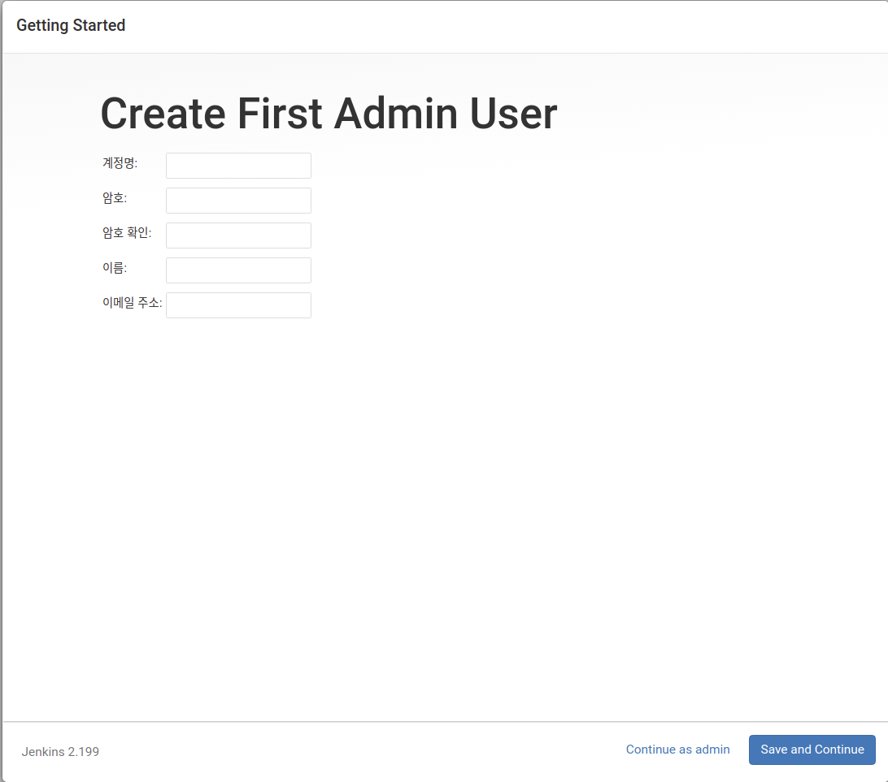
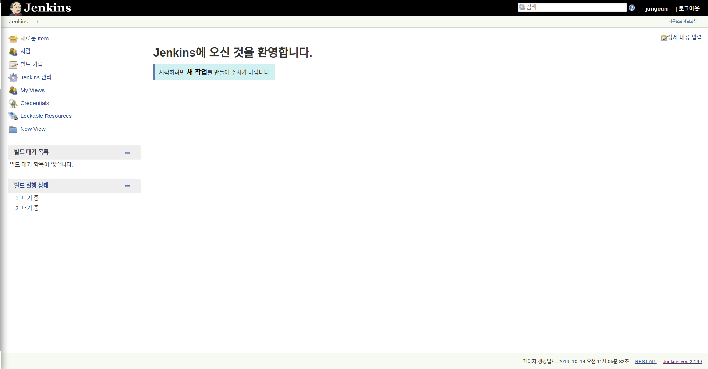

# Jenkins 시작하기

젠킨스를 설치하거나 docker image를 다운 받은 후 run 한다.

본 프로젝트에선 젠킨스를 도커에 올려 사용한다.

```
$ sudo docker pull jenkins/jenkins
```

그리고 젠킨스 initial setup을 위해 docker run을 실행한다.

```
$ sudo docker run -p 8080:8080 -p 50000:50000 jenkins/jenkins
```

조금 기다리고 나면 비밀번호가 뜨는데, 이 초기 비밀번호를 ```localhost:8080```에 입력하면 된다. 이 비밀번호는 컨테이너로 접속하여 ```/var/jenkins_home/secrets/initialAdminPassword```에서도 확인 할 수 있다.

로그인을 하고 나면 필요한 추가적인 plugins을 설치하고, 설치가 완료되면 계정을 만든다.



admin 계정을 만들고 ```jenkins URL```을 설정하고 나면 젠킨스의 Dashboard를 확인할 수 있다.




